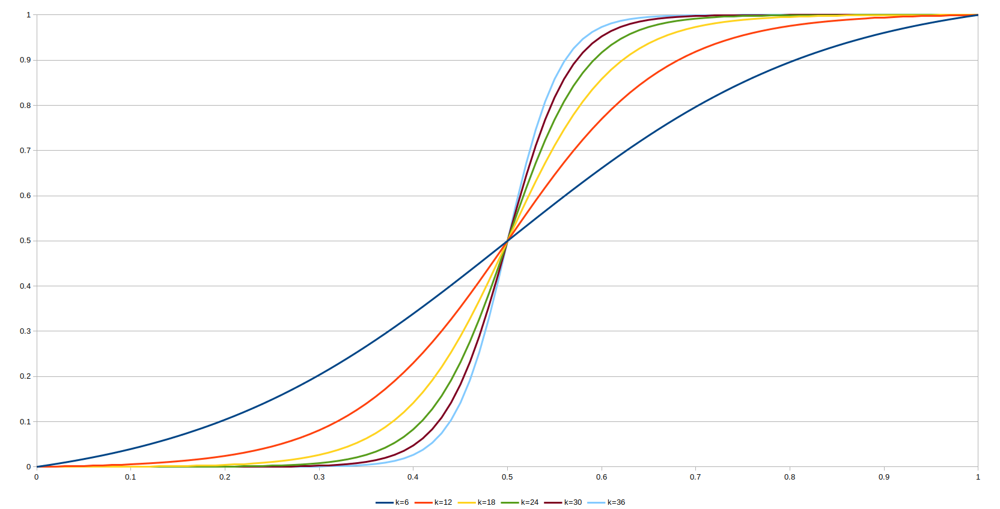

# Some polyphase filter ideas for MiSTer, using PARI/GP

This repo is mostly just for me to learn how Polyphase scaler filtering works, to play around with various filter ideas, and test them out.

With any luck, others might even find some of this useful.


## What's MiSTer?
If you don't know, you're probably in the wrong place... but in short: its an open source platform using an FPGA to simulate various retro game consoles and computers.
Check the [MiSTer Project's wiki](https://github.com/MiSTer-devel/Main_MiSTer/wiki) for more info.


## What's a polyphase filter?
This is the video processing technique used by MiSTer for upscaling images (eg: from 240p console output to 1080p HD), and optionally applying visual effects such as simulating scanlines, etc.

Filters are defined via a text file containing two sets of coefficients (4x16 values per set), one for horizontal scaler, and one for the vertical scaler.
The 4 columns correspond to "taps" (each tap represents an adjacent *input* pixel), and the 16 rows are the "phases".
This 4x16 layout is the default configuration for MiSTer, but the script functions were written to be easily adaptable to other possible configurations if you have some other platform or if MiSTer's changes in the future.

The horizontal and vertical scalers *can* be configured independently, but the filters I've made here just apply the same coefficients for both.

The MiSTer wiki also has a [specific page about its filters](https://github.com/MiSTer-devel/Main_MiSTer/wiki/HDMI-Scaler-Custom-Filter-Coefficients), which explains in more detail, as well as providing some links to other resources.


## What's PARI/GP?
Check out the [PARI/GP homepage](https://pari.math.u-bordeaux.fr) 

PARI is a fast open source math library, with its own scripting language called GP.  It is quite powerful and can be used for a wide variety of tasks.

**Note:** There are already some utilities written by others which use Matlab to help generate these types of filter files, but haven't really looked into it since I don't have a copy of Matlab.
Anyways, I was already familiar with PARI and enjoy using it, so here we are.


## On to the filters!!

Currently there are three general classes of filter that the script generates:

# "Bi-Smooth" interpolation

These are similar to **bi**linear interpolation, but use a [generalized **smooth**step](https://en.wikipedia.org/wiki/Smoothstep#Generalization_to_higher-order_equations) function for interpolation as opposed to linear.

Since the smoothstep equation can be generalized, the script generates a different filter for each of these polynomials:
  - **BiSmooth0** uses a 1st degree (linear) polynomial, which is just the same as (bi)linear interpolation
  - **BiSmooth1** uses a 3rd degree polynomial, which is the canonical **smoothstep** function often used in computer graphics.  It can also be considered a fair approximation to the cosine function.
  - **BiSmooth2** uses a 5th degree polynomial, often referred to as **smootherstep**.
  - and so on... up to **BiSmooth6** (13th degree polynomial)
  - The function which generates these will also accept `-1` for the polynomal number, in which case it just uses a basic Step function.  This is actually **Nearest Neighbor** scaling, (not really a form of smoothstep).

Here is a graph comparing the different generalized smoothstep equations with each other:


So you can see that higher-order versions linger around their endpoints for longer, and have steeper/sharper transitions.
This makes the highest ones resemble "Nearest neighbor" somewhat more than they do "Bilinear", while still keeping a decent amount of smoothing in between values.


# "Logistic" interoplation

These filters operate much the same as Bi-Smooth, but they use yet another type of [sigmoid function](https://en.wikipedia.org/wiki/Sigmoid_function)(TL;DR: functions that form an S-shape, like smoothstep) known as the [Logistic Function](https://en.wikipedia.org/wiki/Logistic_function).

Again this can be parameterized by changing its **k** value, where larger k makes steeper curve with sharper transition.
This is far more convenient to tweak to arbitrary values compared to fixed increments of smoothstep polynomials which become unwieldy at higher levels.

Since this function normally approaches its limits *asymptotically*, I've modified the function by scaling it to go from `f(0)=0`, and `f(1)=1`, regardless of k value.  This variation is called `logisticstep` in the script.

Here is a chart comparing `logisticstep` across a range of k values: (k = 6 to 36, step 6)
 

In the previous case of smoothstep filters, #6 was the highest-order(steepest) one that I bothered to implement, but with the logistic function we can easily make it much steeper.


# "Edge Detect" filters, including bi-smooth interpolation

These are loosely based on edge-detecting [convolution kernels](https://en.wikipedia.org/wiki/Kernel_(image_processing)) which work by subtracting some portion of adjacent color values from the current pixel, resulting in local differences becoming exaggerated.
Another good link [here](http://setosa.io/ev/image-kernels/) with some explanation and live demo of convolution kernels.  My filter is most similar to the kernel that page labels as "outline".

One question I set out to answer with this was whether convolution kernels in general could be translated into an eqivalent polyphase form, since I already had some understanding of convolutions at the start.
As far as I can tell, its not possible in the general case, due to the way that horizontal and vertical passes are applied and summed separately for polyphase.
This means the diagonal corners are always determined by sort of the product of their "side" (cardinal direction) values in polyphase filters, whereas kernels may define completely independent values on their diagonals.
So far a limited subset of 3x3 convolution kernels (where the diagonals multipliers are a product of their corresponding cardinals), it seems we can make a polyphase filter that does the same thing.

I started making this class of filters just for fun, knowing that a pure edge detection would be totally alien looking.
But after testing some variations I found that it might *actually be useful* at low "E" values where it acts as a sort of sharpen filter, making edges more recognizable.

There are 3 parameters that can be varied to generate different filters: 
  - **B**rightness level
    - B128 == 100% full / normal brightness, and probably the most useful.
    - "Normal" edge detection kernels end up summing to 0, which means that they darken the entire image *except* the edges.  So the brightness parameter is here to counteract this darkening to varying degrees.
  - **E**dge strength.  How much to emphasize edges.
    - E128 == 100% "Edge detect"
    - E32 (25%) *or less* is probably in the "reasonable" range of values for sharpening/emphasizing edges without entirely blown out neon halos on everything.
    - Scaler coefficients have a limited bit-size.  Due to these limits, in order for Brightness to counteract the darkening from Edge strentgth, you can have up to 100% **B** OR 100% **E**, but NOT BOTH 100%
  - **S**moothstep polynomial number.
    - Determines which of the Bi-Smooth interpolations to apply between pixels.

With these 3 parameters there's a whole ton of possible combinations, and I've generated 1152 of them!
The majority of these are not particularly practical, having too high **E** values, and/or too low **B** to give a reasonable image, but I found it kinda interesting to sample out what the overall range of parameters can end up looking like.

In case most of these filters are absurd to you, you could copy only the "normal brightness" ones **Edge_B128_...** filters, which narrows it down to "only" 64 of them.


## How do I use your filters?
I've placed the filter files in appropriately-named subfolders of this repo, just upload the folders (or some select set of filters from them) to your MiSTer `/media/fat/Filters/` path via FTP.

They should then be selectable from the OSD menu for any given core.


## How do I use your scripts?
The filters have already been generated and provided in this repo, but if you want to try some other variations, additions, etc, then by all means.

1) Install PARI/GP if you haven't yet
2) Start the gp interactive interpreter from command line with: `gp readall.gp` to automatically load the script file.
   - Alternatively you can start `gp` without arguments, load a specific script in a text editor, and just copy/paste the whole file from text editor into gp's prompt.  Useful for editing.  Can be pasted multiple times to override previous definitions.  If only editing a specific function, can paste just that definition rather than whole file.
   - You can also (re)load script from within gp using the read command, eg: `read("readall.gp")`
3) The scripts generailly just *define* various functions, and don't *run* any code on their own.  So you have to call the desired functions from the gp prompt.

**NOTE:** PARI/GP is cross platform but this script was developed on Linux, and relies on at least one shell command which might need altering to run on another platform.


I've split the functions for specific filter types into their own script files.  Here is summary of the files:
  - `readall.gp` This is just used to include all the other scripts which generate filters.  includes the following scripts: 
    - `utilities.gp` Some general functions for writing filters or CSV files which other scripts depend on
    - `smoothstep.gp` Functions for generating BiSmooth filters
    - `logistic.gp` Functions for generating Logistic filters
    - `edge_detect.gp` Function for generating (also depends on `smoothstep.gp`)
  - `misc.gp` Just a couple extra functions here which I may mess with later
  - `bicubic.gp` Simple test/example of generating coefficients for bicubic interpolation, doesn't generate filter file, just prints coeffs.


## List of main output functions per script, with example calls

## `smoothstep.gp`
```
make_bismooth_filters()
```
Generates `BiSmooth[i].txt` filter files for `i` in range `-1 to 6`
There are some optional parameters for this function, but only relevant for completely different polyphase filter configuration (different # of phases etc).

-------------------------

```
create_csv("smoothstep.csv", smoothstep, Argname="S", Argmin=0, Argmax=6, Argstep=1, Xmin=0, Xmax=1, Xstep=0.01);
```
To re-create the csv used in making the charts.

## `logistic.gp`
```
make_logistic_filters(kmin=4, kmax=24, kstep=2);
```
Generates the filter files with the given range of k values.

-------------------------

```
create_csv("logistic.csv", logisticstep, Argname="k", Argmin=6, Argmax=36, Argstep=6, Xmin=0, Xmax=1, Xstep=0.01);
```
To re-create the csv used in making the charts.
  
## `edge_detect.gp`
```
make_edge_filters(smooth_i=1, emin=8, emax=128, estep=8, bmin=0, bmax=128, bstep=8)
```
Generates the edge-detection style of filters over a combined range of **E** and **B** values, for a single **S** (`smooth_i`) value.

If you just want the full brightness filters for example, set both `bmin` and `bmax` to 128.

The filters in repo were generated by calling 8 times, once for each **S** value: from `make_edge_filters(-1)` to `make_edge_filters(6)`, using the default args for **E** and **B** ranges.

## `bicubic.gp`
**None.**  Loading this script just automatically prints out the coefficients for bicubic interpolation as a test. 

Does not write to an actual filter file (a bicubic filter is already included in MiSTer).


